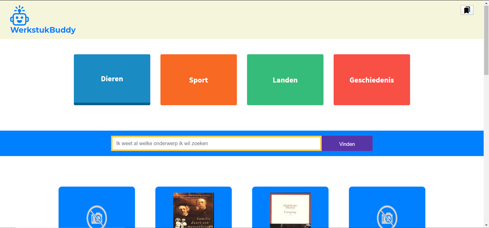

## Zoek in de de collectie van de OBA

Het project vindt plaats bij de Centrale OBA. Maandagochtend is om 10.30 uur de kickoff (10:15 uur inloop), vrijdag zijn de presentaties van de resultaten. In een week bouwt iedere student een eigen prototype dat bezoekers kan helpen om items uit de OBA collectie te vinden. Technieken geleerd bij [CSS to the Rescue](https://github.com/cmda-minor-web/css-to-the-rescue-1819) en [Web App from Scratch](https://github.com/cmda-minor-web/web-app-from-scratch-1819) worden toegepast bij het bouwen van de de prototypes.

## Instructie voor het gebruiken van de API

 [http://zoeken.oba.nl/api/v1](http://zoeken.oba.nl/api/v1)
 
 Zie voorbeeld code in deze repository voor het aanspreken van de API.

## Programma
We verzamelen maandagochtend om 10.15 op de 1e verdieping van de Centrale OBA, [Oosterdokskade 143](https://www.google.com/maps/place/OBA+library+of+Amsterdam/@52.3756983,4.9082087,15z/data=!4m2!3m1!1s0x0:0x6b97f693e6ecb494?ved=2ahUKEwioo6OrzubgAhWLNOwKHR6KDQgQ_BIwCnoECAYQCA).

## Werkwijze en Criteria
### Werkwijze
Full-time week werken aan (technisch) bewijzen van een concept-idee. Vrijdag is de pitch! Student laat zien dat hij/zij de vakken [CSS to the Rescue](https://github.com/cmda-minor-web/css-to-the-rescue-1819) en [Web App from Scratch](https://github.com/cmda-minor-web/web-app-from-scratch-1819) begrijpt en beheerst.

Iedere dag zijn er coaches aanwezig voor coaching en feedback. We sluiten de dag af met een stand up, om de status door te spreken. Waar ben je mee bezig? Loop je ergens vast of heb je hulp nodig? Waar sta je?

### Beoordeling
Tijdens de beoordeling krijg je feedback op het resultaat en op je functioneren. De vakdocenten kijken naar je code en beoordelen In hoeverre je in het project laten zien dat je de bijhorende vakken beheerst en goed hebt toegepast. Lifely is geïnteresseerd in hoeverre je oplossing voldoet aan de eisen die zijzelf stellen aan hun producten. Misschien laat je wel wat zien waar ze zelf nog niet aan gedacht hebben?

Het project telt als AVV mee met de Meesterproef.

### Feedback over functioneren
Je hebt een leergierig, gedreven en zelfredzame houding nodig om de minor te kunnen halen. Welke vaardigheden heb je laten zien? Onderzoekend vermogen? Creativiteit? Conceptueel? In hoeverre komen je houding en verworven vaardigheden overeen met wat een frontender in de praktijk nodig heeft?

### Feedback over Web App from Scratch
In het vak [Web App from Scratch](https://github.com/cmda-minor-web/web-app-from-scratch-1819) heb je geleerd een web app te maken zonder frameworks of onnodige libraries, dus zoveel mogelijk met native HTML, CSS & JavaScript. Het eindproduct is een modulair opgezet prototype voor een single page web app. Data wordt opgehaald uit een externe API, waar nodig gemanipuleerd en vervolgens getoond in de Web App. Je leert hoe structuur aan te brengen in je code en hoe je hiermee 'from scratch' een web app kan maken.

### Feedback over CSS to the Rescue
In het vak [CSS to the Rescue](https://github.com/cmda-minor-web/css-to-the-rescue-1819) heb je geleerd over de (brede) scope van CSS, over Progressive Enhancement, de _cascase_, _inheritance_ en _specifity_. Het is belangrijk om deze basisprincipes van CSS goed te begrijpen. Niet alleen op praktisch niveau, ook op experimenteel niveau. Zonder goed begrip van de basisprincipes is CSS magisch en weird. Met een goed begrip heb je CSS onder controle en kan je het laten doen wat jij wil. En dat is nodig om webpagina’s vorm te geven met attention to detail; webpagina’s waar mensen blij van worden.

### Oplevering & criteria
- Presentatie met je bevindingen bij de OBA. 
- Github met je code en readme.

<!-- Add a link to your live demo in Github Pages 🌐-->

<!-- ☝️ replace this description with a description of your own work -->

<!-- replace the code in the /docs folder with your own, so you can showcase your work with GitHub Pages 🌍 -->

<!-- Add a nice poster image here at the end of the week, showing off your shiny frontend 📸 -->

<!-- Maybe a table of contents here? 📚 -->

<!-- How about a section that describes how to install this project? 🤓 -->

<!-- ...but how does one use this project? What are its features 🤔 -->

<!-- Maybe a checklist of done stuff and stuff still on your wishlist? ✅ -->

<!-- How about a license here? 📜 (or is it a licence?) 🤷 -->
# LibraryNotes

### Description
This webapp should make it easier for kids to find subjects they're interested in for the papers they need 
to write. This means filtering on specific subjects, and being able to see a short description of the books they find. 
If a good book is found, bookmark this book and write short notes about the books that they find. 

## table of contents
- [Live demo](#Live-Demo)
- [Authors](#Authors)
- [features](#Features)
- [API](#API)
- [built with](#built-with)
- [Todo](#todo)
- [Wishlist](#wishlist)

## Live demo
Link to the site: [link](https://heralt.github.io/project-1-1920/)

## Authors 
* **Jaouad Kaouch** 
* **Randy Dalgliesh** 
* **Heralt Levant**
## Features
Search for books that you want to use in your paper and bookmark these books. Bookmarked books are shown in bookmarked 
section with the summary and you're able to start your paper in the bookmark section. 
## API
The [API](https://zoeken.oba.nl/api/v1/) that we used for this project is the OBA API. This API contains data about the books that you're able to borrow 
from the OBA.
## Built with
- Routie.\
- No frameworks are used for this project.
## Todo
- [x] Specific filtering of books
- [x] Bookmark/Notes page
## Wishlist
- [ ] show bookmarked books bookmark section
- [ ] improve detailpage styling 
